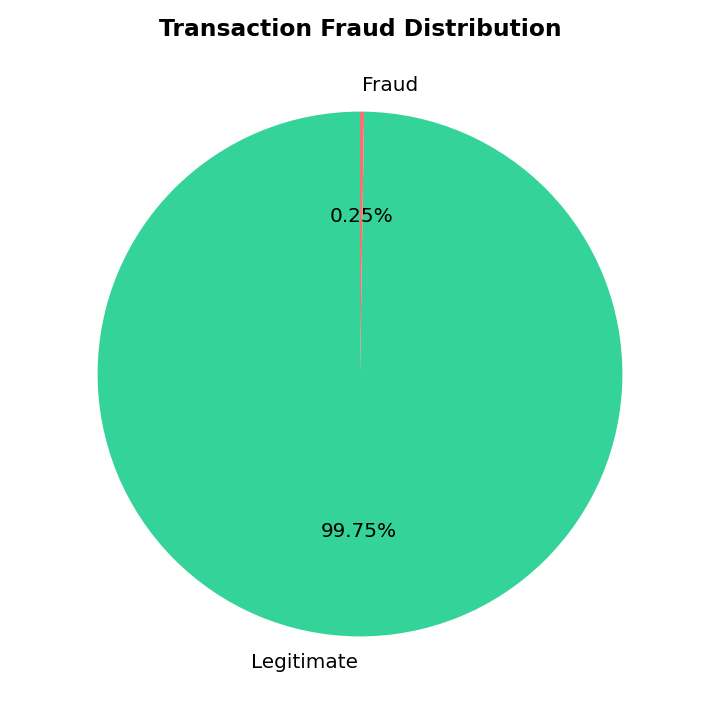
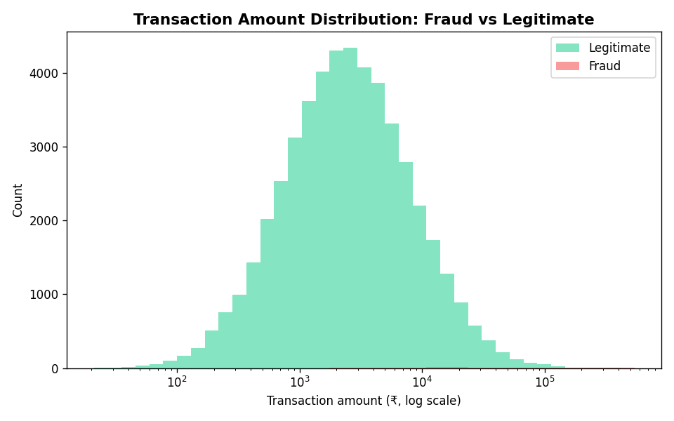
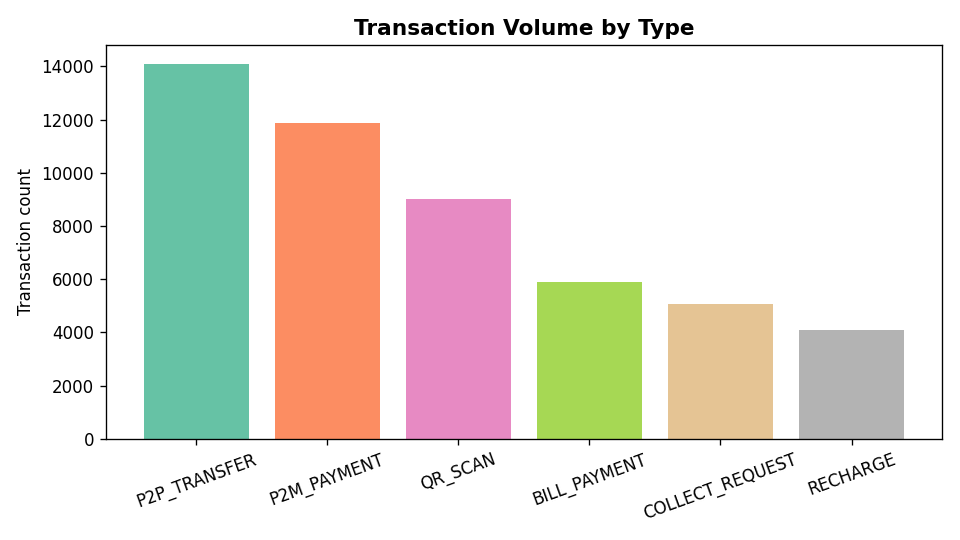
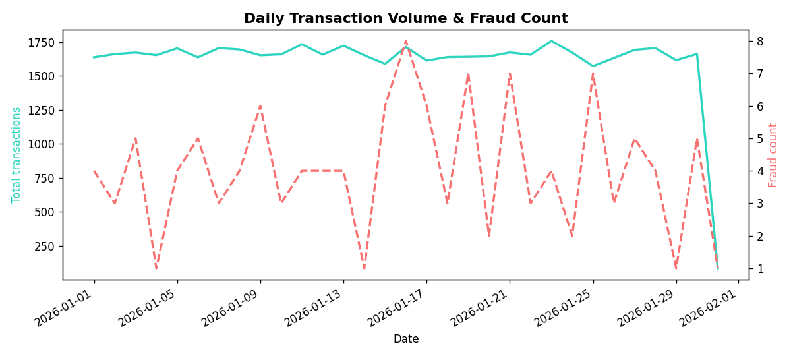

# CBDC Fraud Detection

**Real-time transaction risk scoring for Central Bank Digital Currency (CBDC) transactions, using Random Forest + Isolation Forest, served through a FastAPI backend with a live monitoring dashboard.**


---

## ⚠️ What this is (and isn't)

This is an **educational / portfolio project**, not a production fraud-detection
system. It is **not connected to any real payment network or CBDC pilot** — no
RBI, NPCI, bank, Paytm, GPay, or PhonePe integration of any kind. All
transaction data is synthetic, all wallets are fake, and no real money is
ever involved anywhere in this codebase.

Plugging any system into real transaction processing requires becoming (or
partnering with) a licensed payment aggregator, RBI compliance, NPCI approval,
and formal security audits — this project demonstrates the ML and systems
architecture involved, not a deployable financial product.

## Why the dataset looks like UPI

This project targets **CBDC (India's Digital Rupee / e₹)** fraud detection,
but the synthetic dataset is modeled on **UPI-style transaction patterns**
(VPAs, QR-based payments, collect requests). That's not a mismatch — it's
deliberate:

- RBI has made the e₹ (CBDC-Retail) **interoperable with UPI QR codes** since
  2023 — 13+ banks (SBI, HDFC, Axis, IDFC First, and others) let users pay
  their CBDC wallet balance by scanning the same QR code a merchant already
  uses for UPI.
- CBDC wallets and UPI both settle instantly and share the same QR/wallet
  transaction shape at the front end.
- Real CBDC transaction data isn't publicly available — it's still a limited
  RBI pilot — so UPI-style patterns are the closest, most realistic proxy
  available for modeling fraud behavior on this kind of instant digital wallet system.

## Data provenance — this isn't arbitrary synthetic data

The dataset generator is modeled on **PaySim**, a peer-reviewed financial
fraud simulator built from real financial logs of an actual mobile money
operator running in 14+ countries:

> Lopez-Rojas, E. A., Elmir, A., & Axelsson, S. (2016). *PaySim: A financial
> mobile money simulator for fraud detection.* The 28th European Modeling
> and Simulation Symposium (EMSS), Larnaca, Cyprus.

PaySim (and derivatives of it) is a standard, widely-cited benchmark in
published fraud-detection research — this isn't ad-hoc random data, it's a
recognized simulation methodology used specifically because real financial
transaction data can't be publicly shared for privacy reasons.

### Real-world validation (optional, run yourself)

For an additional, non-synthetic data point: [`scripts/validate_on_real_data.py`](scripts/validate_on_real_data.py)
runs the exact same modeling approach (Random Forest + Isolation Forest,
weighted combination) against the **ULB Credit Card Fraud Detection
dataset** — 284,807 real, anonymized European card transactions, the
standard academic and industry benchmark for fraud detection research.

```bash
# 1. Download creditcard.csv from https://www.kaggle.com/datasets/mlg-ulb/creditcardfraud
#    (free Kaggle account required)
# 2. Place it in scripts/
cd scripts
python3 validate_on_real_data.py
```

This produces `real_data_validation_report.md` with precision/recall/F1 on
real transaction data — worth running and citing alongside the synthetic
results if you want to show the approach generalizes beyond simulation.

## What it does

Every transaction submitted to the API is scored in real time by two models
working together:

- **Random Forest** (supervised) — recognizes patterns similar to labeled fraud examples
- **Isolation Forest** (unsupervised) — flags statistical anomalies, catching patterns the supervised model has never seen

```
final_risk_score = 0.6 × RF_fraud_probability + 0.4 × IsolationForest_anomaly_score
```

Transactions scoring above the threshold are held for review instead of
auto-blocked — a deliberate human-in-the-loop design, since false positives
are common in any ML fraud system and instant settlement makes wrongful
auto-blocking costly to a real user.

## Results (on synthetic data)

Evaluated on a held-out test set of 12,500 transactions (31 fraud):

| Metric | Score |
|---|---|
| Precision (fraud class) | 0.844 |
| Recall (fraud class) | 0.871 |
| F1 score | 0.857 |
| ROC-AUC | 0.998 |

**Why not accuracy?** Fraud is ~0.25% of the dataset — a model predicting
"not fraud" every time would already be 99.75% "accurate" while catching zero
fraud. Precision/recall/F1 on the fraud class are the metrics that actually
matter here. Full report: [`models/evaluation_report.md`](models/evaluation_report.md).

## Exploratory data analysis

<table>
<tr>
<td></td>
<td></td>
</tr>
<tr>
<td></td>
<td></td>
</tr>
</table>

More in [`eda_output/`](eda_output/) — generated by [`scripts/eda.py`](scripts/eda.py).

## Architecture

```
Wallet App  ──POST /transaction──▶  FastAPI Backend  ──▶  ML Engine (RF + IsoForest)
                                          │                        │
                                          ▼                        ▼
                                      SQLite DB              risk score
                                          │
                                          ▼
                              WebSocket ──▶ Live Dashboard
```

Both a user-initiated transaction (via the wallet form) and the background
traffic simulator call the same `/transaction` endpoint — the risk check
doesn't care who initiated the transaction, mirroring how real fraud-detection
services (e.g. Razorpay's Thirdwatch) plug into a payment gateway as a
pluggable layer rather than being embedded in the client app.

## Project structure

```
cbdc-fraud-detection/
├── data/                  # Synthetic UPI-style transaction dataset (CBDC proxy)
├── scripts/
│   ├── generate_dataset.py   # Regenerate the dataset
│   ├── train_models.py       # Train Random Forest + Isolation Forest
│   └── eda.py                 # Exploratory data analysis + charts
├── models/                # Trained models + evaluation report
├── backend/
│   ├── main.py             # FastAPI app — real-time risk-check API
│   └── requirements.txt
├── frontend/
│   └── index.html          # Dashboard + wallet UI (no build step)
└── eda_output/             # Generated charts
```

## Quickstart

```bash
git clone https://github.com/<your-username>/cbdc-fraud-detection.git
cd cbdc-fraud-detection/backend
pip install -r requirements.txt
uvicorn main:app --reload --port 8000
```

Then open **`http://localhost:8000`** in a browser — the backend serves the
dashboard directly, so there's nothing else to start. Interactive API docs
are at `http://localhost:8000/docs`.

### Deploying it live

See [DEPLOYMENT.md](DEPLOYMENT.md) — deploys as a single Render service
(free tier), giving you one URL that serves both the dashboard and the API.

### Regenerating the dataset / retraining

```bash
cd scripts
python3 generate_dataset.py
python3 train_models.py
python3 eda.py
```

## Tech stack

- **Backend:** FastAPI, SQLite, WebSockets
- **ML:** scikit-learn (Random Forest, Isolation Forest)
- **Frontend:** vanilla HTML/CSS/JS (zero dependencies)
- **Data:** pandas, numpy

## Known limitations

- Trained entirely on synthetic, UPI-modeled data — not real CBDC transaction
  data, which isn't publicly available since India's Digital Rupee is still
  in a limited RBI pilot
- Cannot detect social-engineering fraud where a victim knowingly authorizes
  a transaction themselves — an open, industry-wide problem, not specific to this project
- Model combination weights (0.6 / 0.4) are reasoned defaults, not formally optimized
- SQLite is used for simplicity; a real deployment would need a production database

## Future scope

- Continuous retraining from analyst-confirmed labels (feedback loop)
- SHAP-based explainability per flagged transaction
- Sequence/graph-based models (LSTM/GNN) for mule-network detection
- Step-up authentication flow instead of hard holds for medium-risk transactions
- Retraining directly on real CBDC pilot data if/when RBI makes it available

## Contributing

See [CONTRIBUTING.md](CONTRIBUTING.md).

## License

[MIT](LICENSE)
